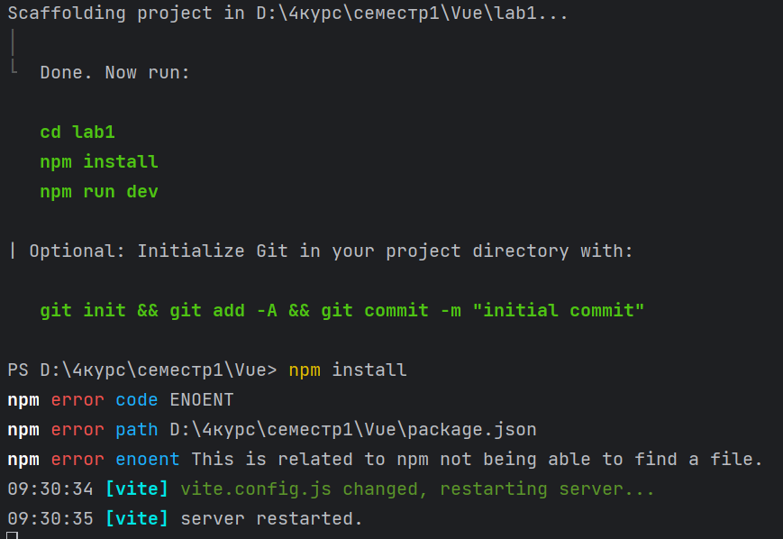
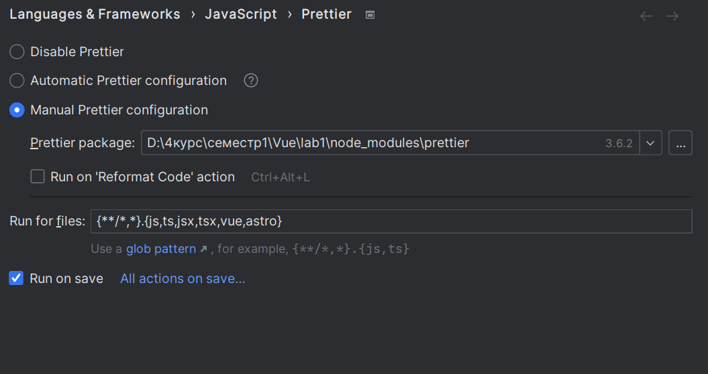
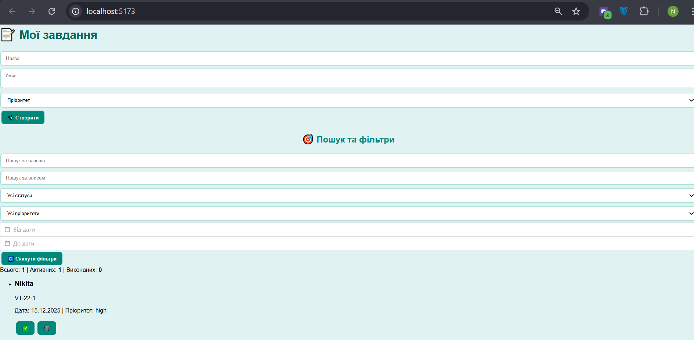
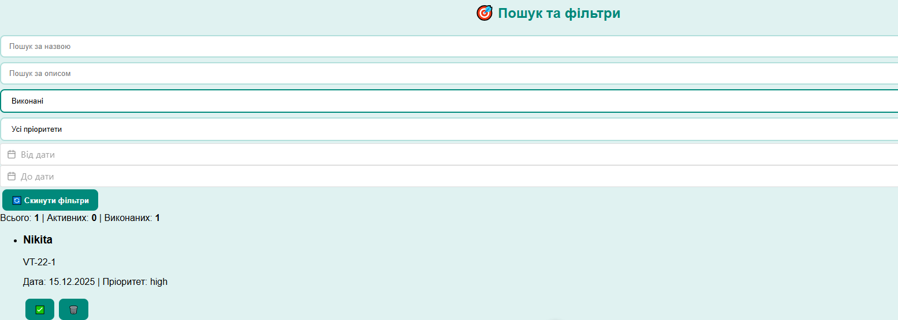

# lab1
### Створення проекту



### Налаштування prettier 


# Lab1 — ToDo Manager на Vue.js

## Опис
Простий застосунок для керування списком завдань із такими можливостями:
- Додавання завдання (мінімальна валідація);
- Перемикання статусу (active ↔ done);
- Видалення завдання;
- Редагування завдання;
- Фільтрація за полями (title, description, status, createdAt, priority);
- Очистка фільтрів;
- Лічильники (загальна кількість, активні, виконані);
- Вибір дати через `@vuepic/vue-datepicker`;
- Збереження у LocalStorage;
- Пагінація для зручності;
- Простий рожевий UI/UX.

---

## Кроки запуску

1. Клонувати репозиторій або відкрити проєкт у VS Code.
2. Встановити залежності:
   ```bash
   npm install

3. Запустити проєкт:
   ```bash
   npm run dev
4. Відкрити у браузері http://localhost:5173

## Використані можливості Vue

### Реактивність
- `ref` — використано для:
   - введення полів форми (title, description, priority);
   - фільтрів (наприклад, `filters.title`, `filters.createdAt`);
- `reactive` — для зберігання списку завдань як єдиної структури.

### Computed
- Підрахунок кількості:
   - `totalTasks` (усі завдання),
   - `activeTasks` (статус = active),
   - `completedTasks` (статус = done)
- Фільтрація завдань (відображаються тільки ті, що підходять під умови)

### Watch
- `watch(tasks, { deep: true })` — при будь-якій зміні списку він зберігається у LocalStorage

### Директиви
- `v-model` — прив’язка інпутів і селектів (title, description, priority, filters).
- `v-on / @` — обробка подій (`@click`, `@submit`).
- `v-bind / :` — прив’язка атрибутів (`:class`, `:placeholder`).
- `v-for` — відображення списку завдань та пагінації.
- `v-if / v-else` — умовне відображення повідомлень («Немає завдань»).
- `v-show` — використано для показу/приховування елементів у фільтрах.

---

## DevTools
- **LocalStorage**: у вкладці Application → LocalStorage зберігається весь список завдань у форматі JSON.
- **Computed**: у Vue DevTools можна переглянути, як автоматично обчислюються `totalTasks`, `activeTasks`, `completedTasks`.
- **Watch**: видно, як при зміні списку він автоматично оновлюється в LocalStorage.

---

## Скріншоти

### Головний інтерфейс
Створення нового завдання

### Фільтри
Фільтр по виконанних завданнях

Фільтр по активних завданнях


### LocalStorage

