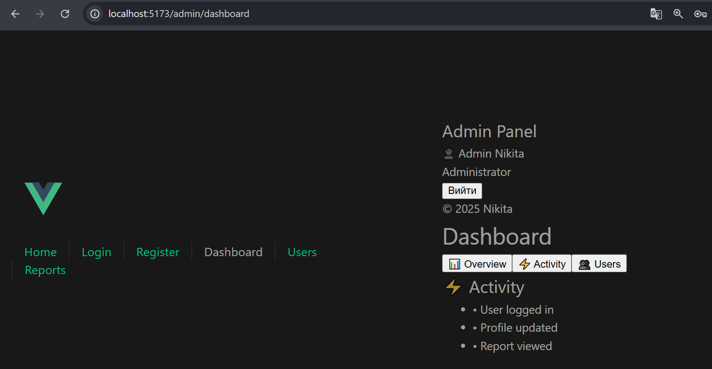
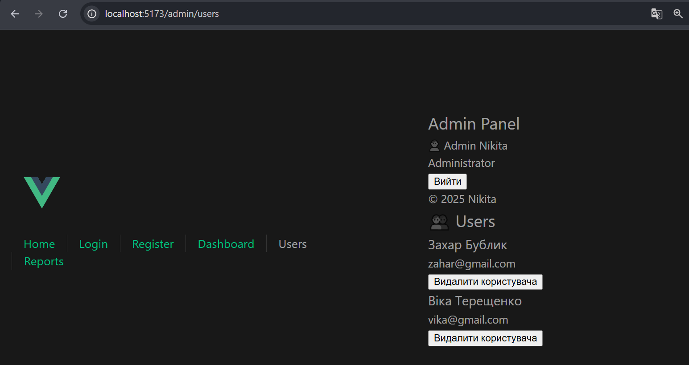
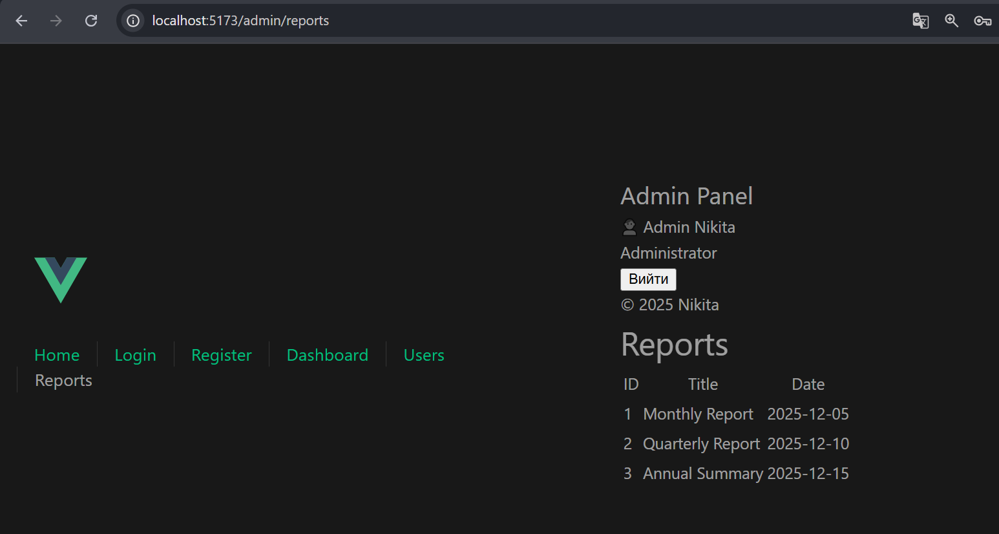

# Mini Admin Panel 

Демонстрація:
- **props / emits**
- **v-model / defineModel**
- **provide / inject**
- **slots (default, named, scoped)**
- **KeepAlive + життєвий цикл компонентів**
- **Vue Router (lazy-loading, auth-guard, scrollBehavior, linkActiveClass)**

---

## Запуск проєкту

```bash
# 1. Встановлення залежностей
npm install

# 2. Запуск локального сервера
npm run dev

# 3. Відкрити у браузері:
http://localhost:5173/
```
## Маршрути
| Шлях                 | Опис                                     | Доступ         |
|----------------------|------------------------------------------|----------------|
| `/`                  | Home (публічна сторінка)                 | ✅ public      |
| `/login`             | Авторизація                              | ✅ public      |
| `/register`          | Реєстрація                               | ✅ public      |
| `/admin/dashboard`   | Панель адміністратора + вкладки          | 🔒 requiresAuth|
| `/admin/users`       | Список користувачів                      | 🔒 requiresAuth|
| `/admin/reports`     | Reports зі scoped slot                   | 🔒 requiresAuth|
| `/:pathMatch(.*)*`   | 404 Not Found                            | ✅ public      |

## Де саме застосовані вимоги

| Механізм               | Де реалізовано                                                                 |
|------------------------|---------------------------------------------------------------------------------|
| **props / emits**      | `UserCard.vue` — отримує дані користувача через props і відправляє `emit('remove')` у `Dashboard.vue` |
| **v-model / defineModel** | `BaseInput.vue` — реалізація двостороннього зв'язку, використовується в `Login.vue` та `Register.vue` |
| **provide / inject**   | `AdminLayout.vue` (provide currentUser) → `Sidebar.vue` (inject currentUser)   |
| **Default slot**       | `AuthLayout.vue` — обгортка для Login/Register, контент вставляється через `<slot>` |
| **Named slot**         | `Sidebar.vue` — використовуються `slot name="menu"` та `slot name="footer"`    |
| **Scoped slot**        | `Reports.vue` — `<slot name="row" :item="item">...</slot>` для кастомного рендеру рядків |
| **KeepAlive**          | `Dashboard.vue` — вкладки Overview / Activity / Users обгорнуті в `<KeepAlive>` |
| **Lifecycle hooks**    | У вкладках `Overview.vue`, `Activity.vue` — `onMounted`, `onActivated`, `onDeactivated` |
| **Lazy-loading routes**| У файлі `router/index.js` — через синтаксис `() => import('../views/...')`     |
| **Auth Guard**         | `router.beforeEach` — перевіряє наявність `auth_token` у `localStorage` перед переходом на захищені маршрути |

## Скріншоти



