# Лабораторна робота №3 — Ноовини Cosmos Chronicle

## Основний функціонал

### Головна сторінка (`/`)
- Список новин з локального файлу **`src/data/newsData.js`**
- Відображення реалізовано у файлі **`src/views/HomeView.vue`**
- Кожна новина — окремий компонент **`src/components/NewsCard.vue`**
- Рекламні слоти **`src/components/AdSlot.vue`**

---

### 📰 Сторінка повної новини (`/article/:id`)
- Реалізована у файлі **`src/views/ArticleView.vue`**
- Отримує параметр **`id`** через **`useRoute()`** та шукає новину в масиві `news`
- Є кнопка повернення на головну сторінку

---

### ℹ️ Інформаційна сторінка (`/about`)
- Розташована у файлі **`src/views/AboutView.vue`**
- Містить опис про сайт і компонент реклами **`AdSlot`**

---

### Сторінка 404 (`/:pathMatch(.*)*`)
- Реалізована у файлі **`src/views/NotFoundView.vue`**

---

### Компоненти
- **`src/components/HeaderComponent.vue`** — логотип, навігація (*Home / About*), перемикач теми
- **`src/components/FooterComponent.vue`** — копірайт, прості навігаційні посилання
- **`src/components/AdSlot.vue`** — рекламний блок з модальним вікном
- **`src/layout/MainLayout.vue`** — загальний каркас сторінки (*Header + Footer + RouterView*)

---

### Теми (Dark / Light)
- Збереження вибору теми у **`localStorage`**
- Логіка перемикача теми реалізована у файлі **`src/components/HeaderComponent.vue`**
- Глобальні стилі теми визначені у файлі **`src/assets/main.css`**

---

### Плавні переходи між сторінками
- Реалізовані у файлі **`src/App.vue`**
- Використано компонент
  ```vue
  <Transition name="fade" mode="out-in">

---

### Роутинг
- налаштовано у **`src/router/index.js`**
- Використано **`createWebHistory`**, **`scrollBehavior`**, **`linkActiveClass`**

---
## 🖼️ Скріншоти

### 🌞 Світла тема
Головна сторінка
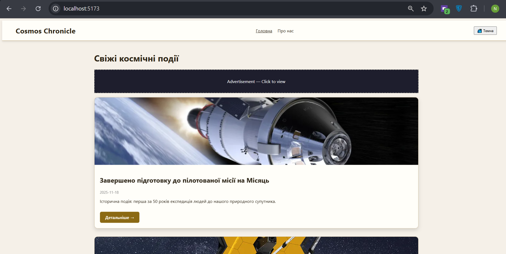
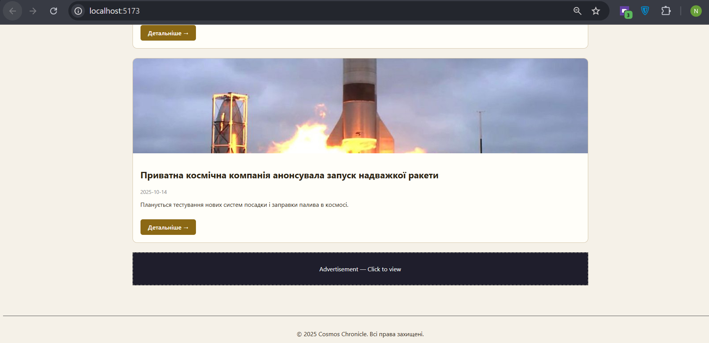

Перехіх на якусь конкретну новину
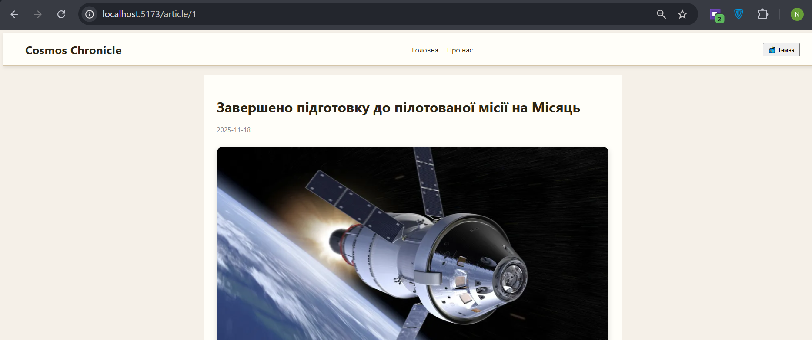
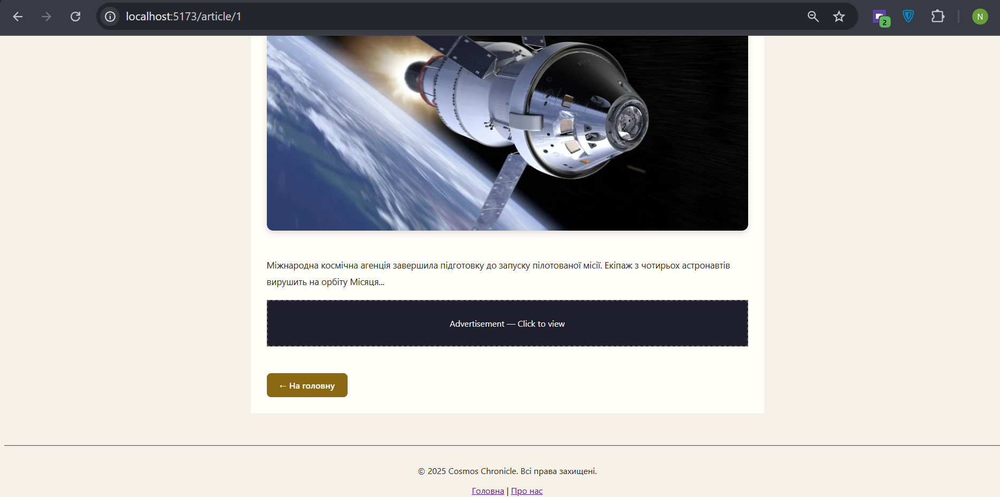

При натиску на рекламу
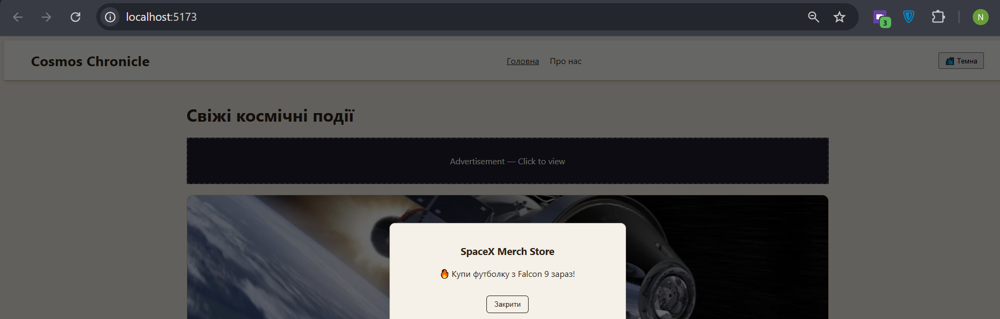

Вкладка About
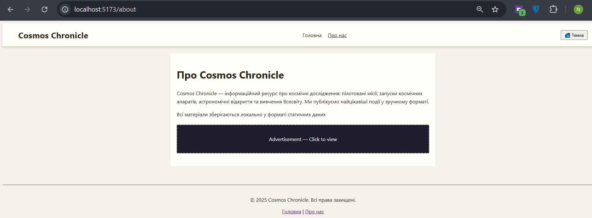

Натиск на рекламу
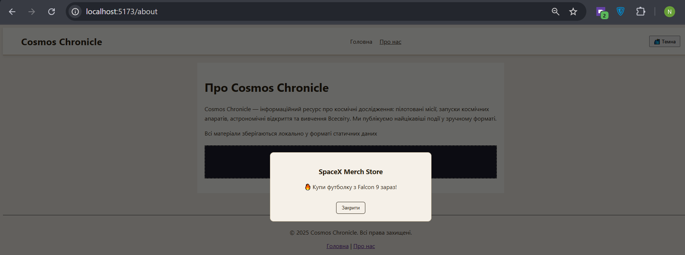

---

### 🌞 Темна тема
Головна сторінка
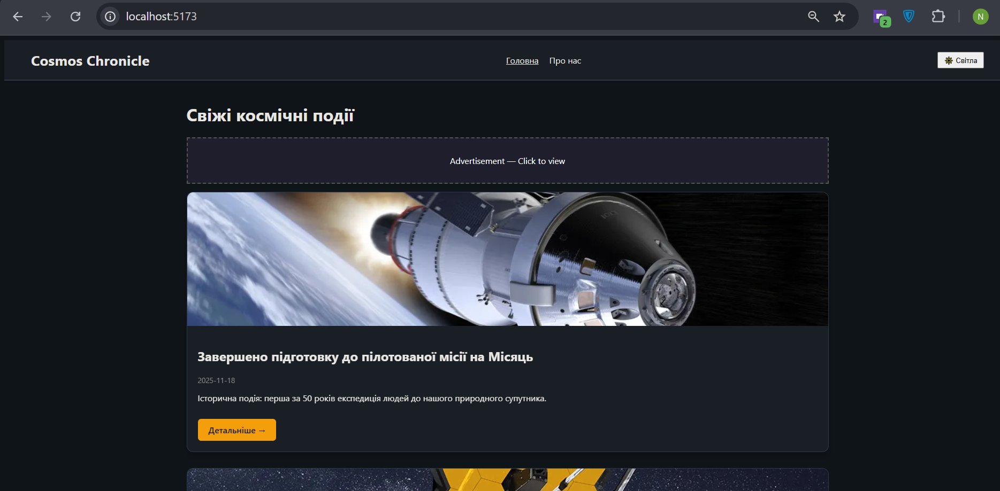
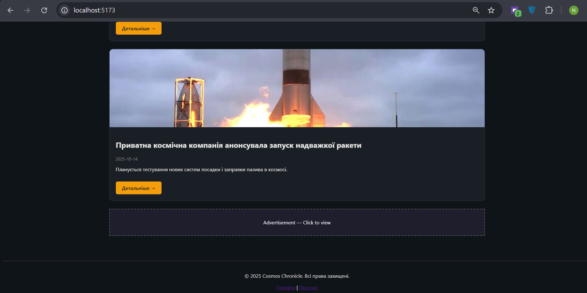

Перехіх на якусь конкретну новину
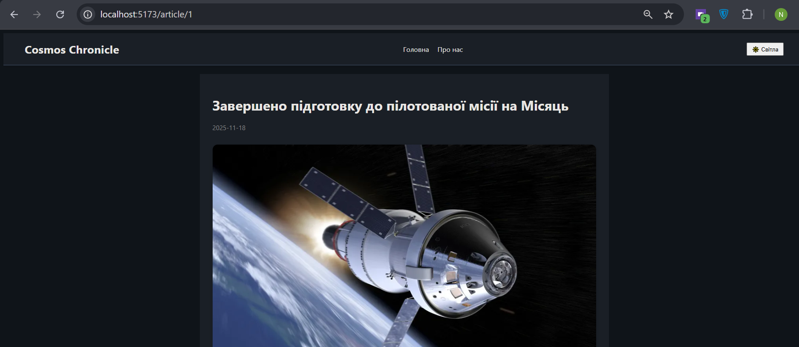
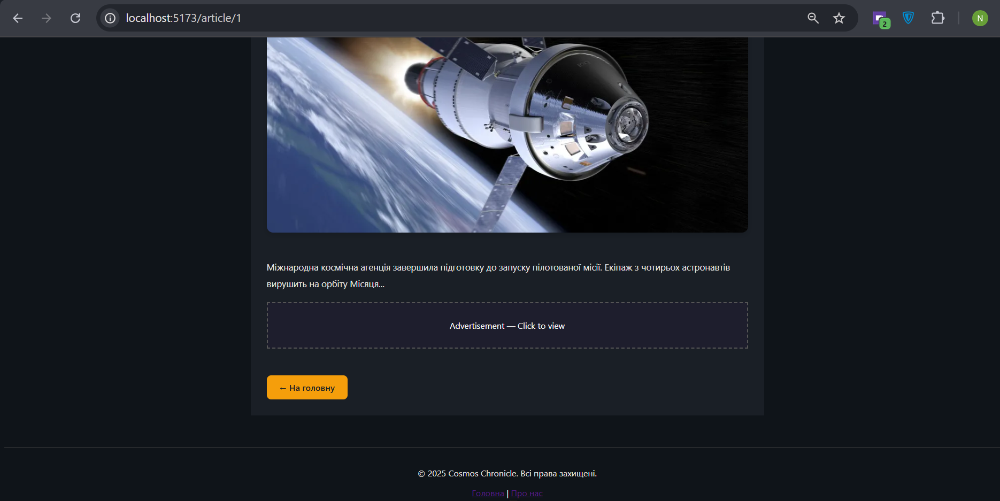

При натиску на рекламу
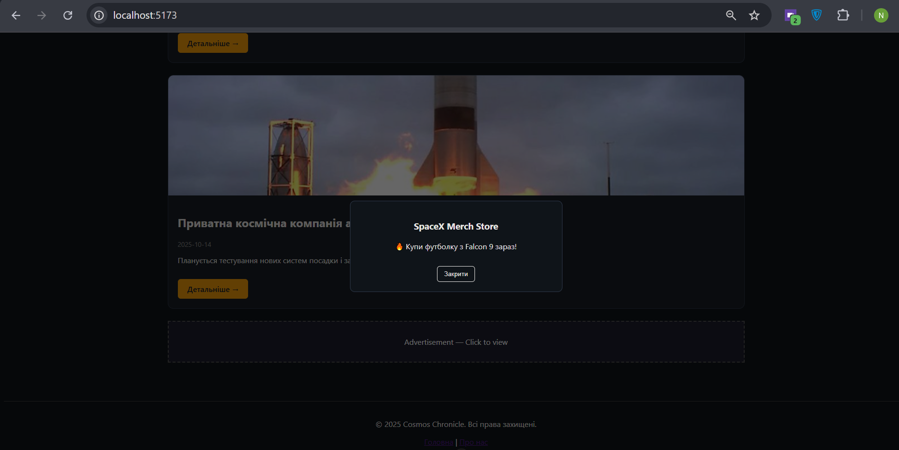

Вкладка About
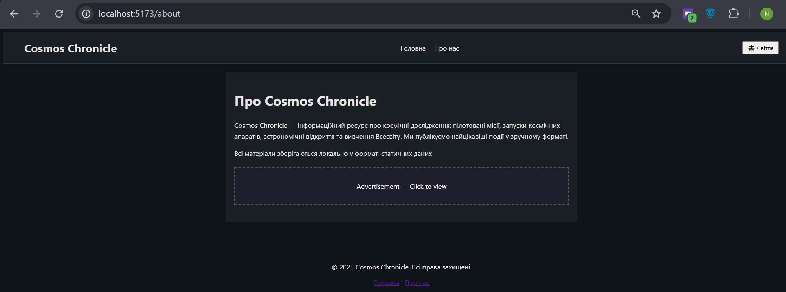

Натиск на рекламу


## Висновок

Стилізація у **Vue.js** має кілька ключових особливостей:

1. **Локальна ізоляція стилів** — завдяки атрибуту `scoped` у `<style>` кожен компонент має власні стилі, що не конфліктують із іншими.  
   ➤ Використано у більшості компонентів: **`HeaderComponent.vue`**, **`ArticleView.vue`**, **`NewsCard.vue`**.

2. **Глобальні стилі** — у файлі **`src/assets/main.css`** описані змінні кольорів для теми:  
   `--bg`, `--text`, `--link`, `--border`.  
   Ці змінні дозволяють легко змінювати зовнішній вигляд усіх елементів сайту,відповідно до ситуації

3. **Реактивність теми** — у файлі **`HeaderComponent.vue`** реалізовано перемикач теми, який змінює атрибут `data-theme` на елементі `<html>`  
   і зберігає вибір користувача у `localStorage`.

4. **Гнучкість стилізації** — у проєкті поєднано **локальні scoped-стилі** для компонентів  
   та **глобальні змінні теми**, що дозволяє створювати узгоджений дизайн без конфліктів.

5. **Плавні переходи між сторінками** — у файлі **`src/App.vue`** використано компонент
   ```vue
   <Transition name="fade" mode="out-in">