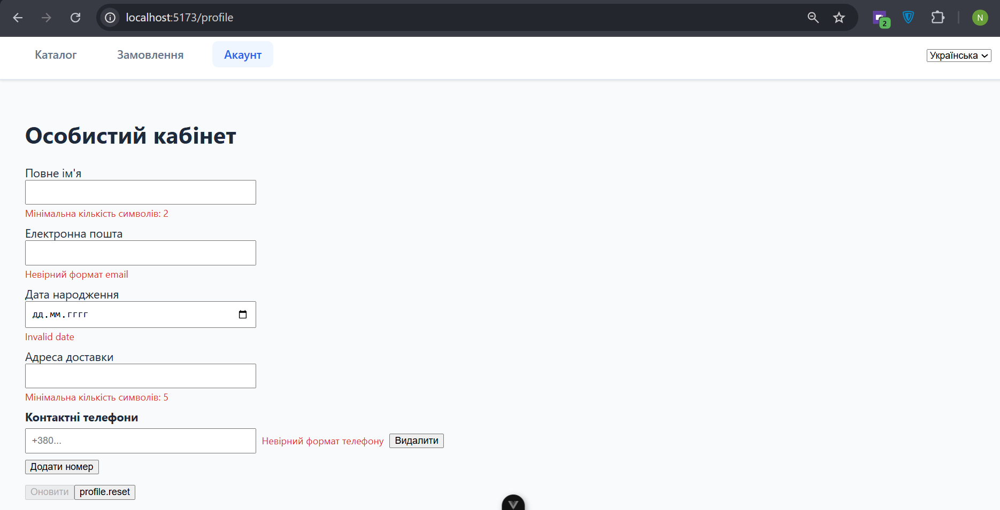
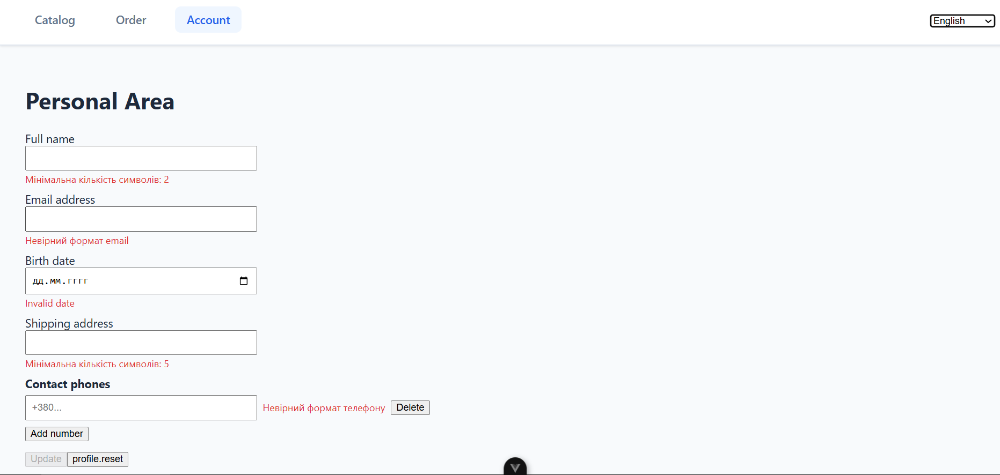
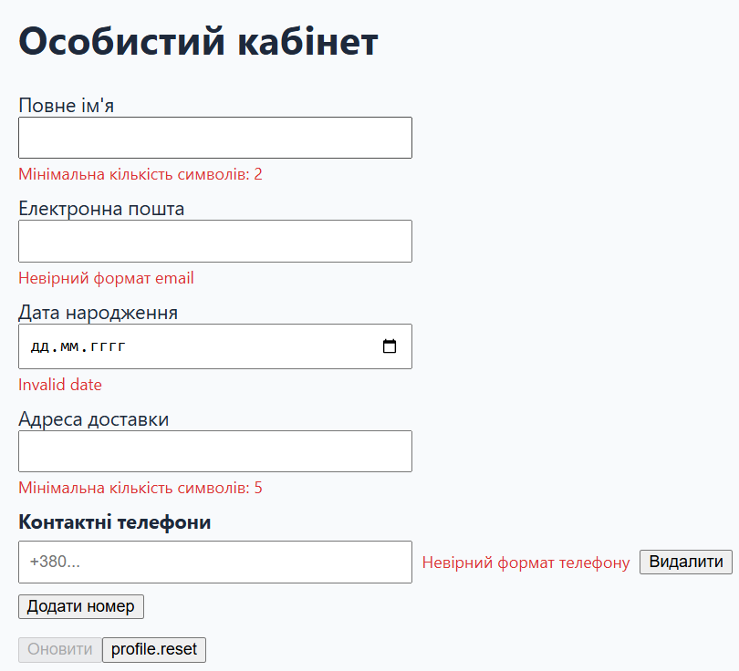
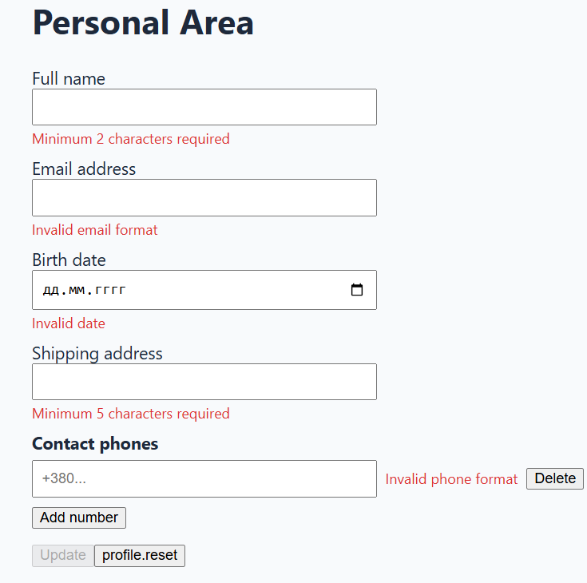
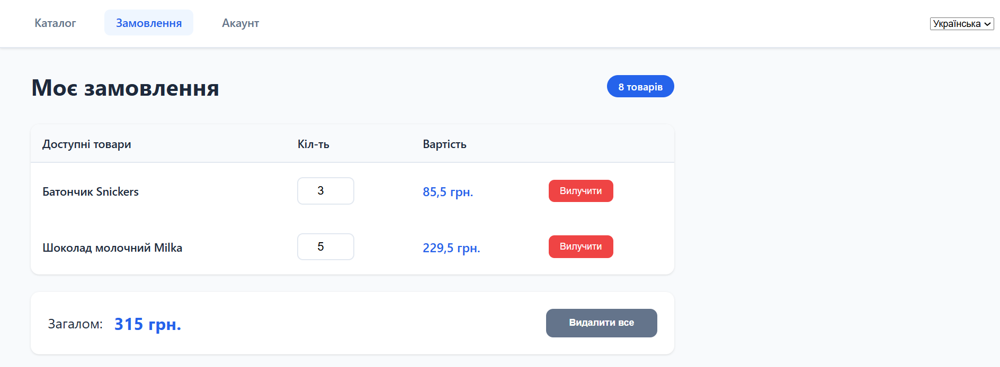
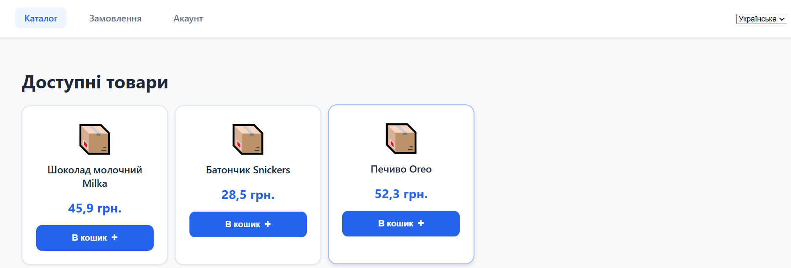
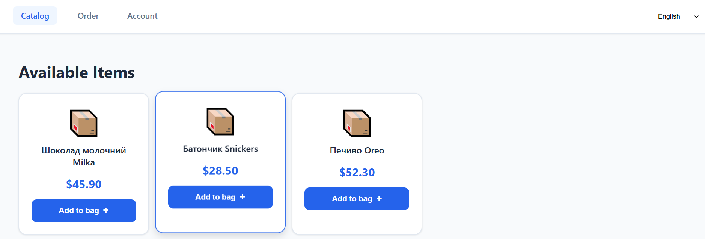

# lab4
## Структура сторів
| Файл               | Призначення                                                                 |
|------------------------|---------------------------------------------------------------------------------|
| **settings.js**      | Зберігає вибрану мову інтерфейсу (locale) з персистентністю через `pinia-plugin-persistedstate` |
| **products.js** | Містить список товарів, що відображаються на сторінці Products |
| **cart.js**   | Реалізує кошик користувача: додавання, видалення, очищення, підрахунок кількості (`count`) і загальної суми (`subtotal`)   |
---
### Використані концепції Pinia

- **`createPinia()`** — створення основного сховища у `main.js`.
- **`defineStore()`** — оголошення стора для `settings`, `cart`, `products`.
- **`storeToRefs()`** — реактивне зчитування стану стора у компонентах.
- **`pinia-plugin-persistedstate`** — збереження стану (`locale`, `cart`) у `localStorage`.
- **custom key:**
  ```js
  persist: { key: 'settings' }
  ```

pick/omit: можна вибірково зберігати окремі поля
```bash
persist: { paths: ['locale'] }
```
----

### i18n (локалізація)

Ініціалізація у файлі `src/i18n.js`:

```js
const i18n = createI18n({
  legacy: false,
  locale: 'ua',
  fallbackLocale: 'en',
  messages: { ua, en },
  modifiers,
  numberFormats,
  datetimeFormats
})
````
#### Застосовано:

* **`createI18n()`** — створення глобального інстансу з перекладами.

* **`messages`** — файли `src/locales/ua.json` і `src/locales/en.json`.

* **Кастомний модифікатор:**

  ```js
  const modifiers = {
    upper: (str) => str.toUpperCase(),
    cap: (str) => str.charAt(0).toUpperCase() + str.slice(1)
  }
  ```
  Використовується в перекладах через `@.upper:{text}`.

* **Синхронізація з `settings.locale`:**
  при зміні мови у `LanguageSwitcher.vue` оновлюється `i18n.locale.value`.
---

### VeeValidate (форми та валідація)

Використовується у `Profile.vue` для створення реактивної форми з динамічним масивом телефонів

#### Ключові API

- **`useForm()`**, **`useField()`**, **`useFieldArray()`** — створення реактивної форми, окремих полів і масиву телефонів.  
- **`validationSchema`** — побудована через **Zod** (`toTypedSchema()` з `@vee-validate/zod`).  
- **`setFieldError()`** — може використовуватись для примусового встановлення помилок після сабміту.  
- **`configure()`** — (опціонально) глобальне налаштування поведінки валідації.  

#### Приклад схеми
```js
const schema = toTypedSchema(
  z.object({
    name: z.string().min(2, { message: t('validation.minChars', { min: 2 }) }),
    email: z.string().email({ message: t('validation.email') }),
    dateOfBirth: z.coerce.date({
      invalid_type_error: t('validation.date'),
      required_error: t('validation.required')
    }),
    address: z.string().min(5, { message: t('validation.minChars', { min: 5 }) }),
    phones: z.array(
      z.string()
        .regex(/^\+?[0-9\s\-()]{7,20}$/, { message: t('validation.phone') })
        .nonempty({ message: t('validation.required') })
    ).min(1)
  })
)
```
---

### Де застосовано основні технології

| Технологія | Файл | Призначення |
|-------------|------|-------------|
| **Pinia** | `main.js`, `stores/*.js` | Глобальний стан (`locale`, `cart`, `products`), персистентність даних |
| **vue-i18n** | `i18n.js`, `LanguageSwitcher.vue` | Локалізація рядків, форматування чисел і дат, кастомні модифікатори |
| **VeeValidate + Zod** | `Profile.vue` | Форма з динамічними телефонами, локалізованими повідомленнями про помилки |
---

### Скріншоти

1. **Profile (ua)** — форма з українськими підписами.  
   

2. **Profile (en)** — та сама форма після перемикання мови на англійську 
   

3. **Валідаційні повідомлення** — приклади помилок при неправильному введенні (некоректний email, порожнє ім’я тощо).  
   Українською
   
   Англійською
   

4. **Cart** — сторінка кошика з підрахунком кількості, сумою, кнопками "Очистити" / "Видалити".  
   Українською
   
   Англійською
   
5. **Product** - головна сторінка з продуктами
   Українською
   
   Англійською
   


