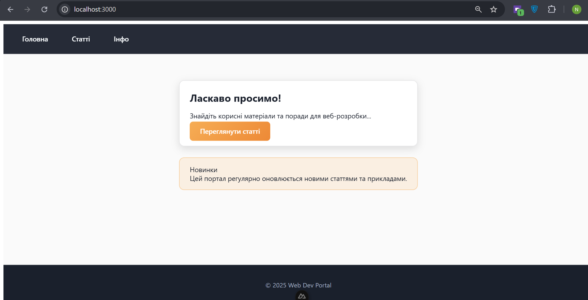
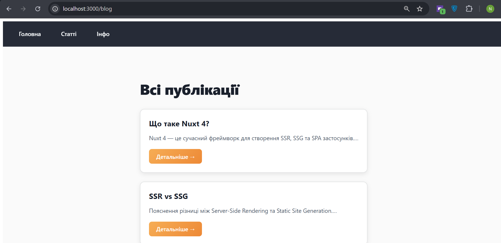
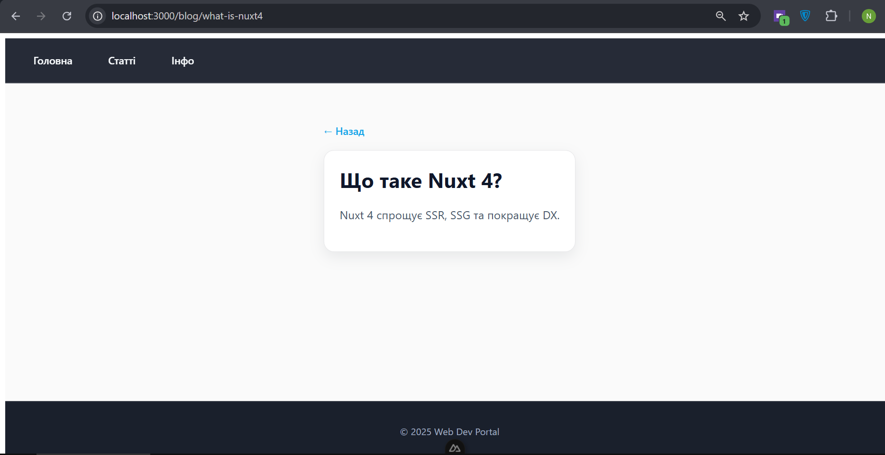
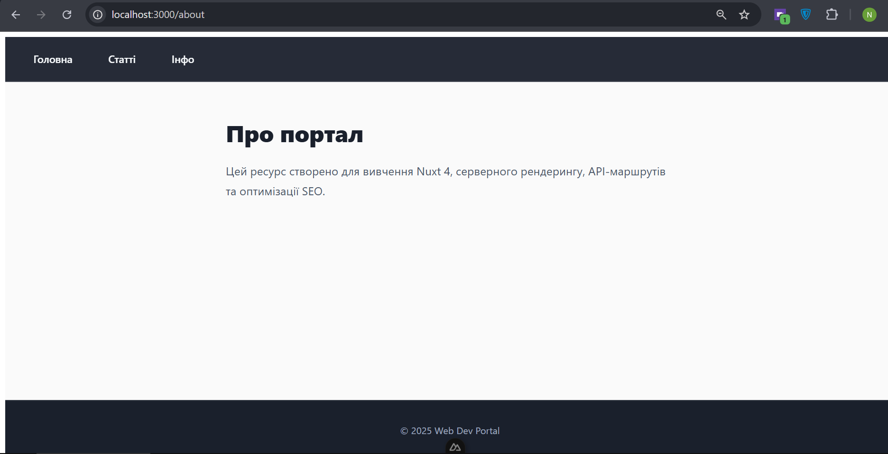

## Скріншоти основних сторінок

/


/blog


/blog/[slug]


/about

---
## Використання useFetch

Функція `useFetch` використовується для отримання даних із серверних маршрутів (Nitro API).

### Отримання всіх статей
**Файл:** `pages/blog/index.vue`

```ts
const { data: posts, pending, error } = await useFetch("/api/posts");
```
### Отримання однієї статті
**Файл:** `pages/blog/[slug].vue`

```ts
const { data: post, pending, error } = await useFetch(() => `/api/posts/${route.params.slug}`);
```
---
## Розташування API
Усі серверні маршрути знаходяться в директорії:

`server/api/`

### Список статей
Файл: [Список статей](server/api/posts.get.ts) `server/api/posts.get.ts`

### Окрема стаття
Файл: [Окрема стаття](server/api/posts/[slug].get.ts) `server/api/posts/[slug].get.ts`

---
## SEO-теги (useSeoMeta)

SEO-теги налаштовані на кожній сторінці за допомогою `useSeoMeta`.  
Використовуються динамічні значення для title, description та Open Graph.

### Приклад (`pages/blog/[slug].vue`)

```ts
useSeoMeta({
  title: () => `${post.value?.title} — Nuxt Course Blog`,
  description: () => post.value?.content?.slice(0, 120),
  ogTitle: () => post.value?.title,
  ogDescription: () => post.value?.content?.slice(0, 120),
});
```
### Перевірка
DevTools → Elements → <head>

Там будуть видні:
- `<title>`
- `<meta name="description">`
- `<meta property="og:title">`
- `<meta property="og:description">`
---
## sitemap.xml — модуль @nuxtjs/sitemap

Для автоматичної генерації карти сайту використовується модуль `@nuxtjs/sitemap`.

Конфігурація додана у `nuxt.config.ts`:

```ts
modules: ["@nuxtjs/sitemap"]
```

Sitemap автоматично включає основні маршрути:
- /
- /about
- /blog

- усі динамічні сторінки /blog/[slug]
### Перевірка
Відкрити у браузері:
`http://localhost:3000/sitemap.xml`
---
## robots.txt — модуль @nuxtjs/robots

Для керування індексацією використовується модуль `@nuxtjs/robots`.

Конфігурація у `nuxt.config.ts`:

```ts
robots: {
  allow: ["/", "/about", "/blog"],
  disallow: ["/admin", "/api", "/api/*"]
}
```
Дозволено індексувати:
- /
- /about
- /blog
- /blog[slug]

Заборонено індексувати:
- /admin
- /api/*
### Перевірка
Оскільки у dev-режимі Nuxt блокує індексацію, перевірку потрібно робити так:
`http://localhost:3000/robots.txt?mockProductionEnv`
---
## Використані компоненти Nuxt UI

У проєкті використовується бібліотека Nuxt UI. Її компоненти застосовано на кількох сторінках

### На сторінці `/`
- `UContainer`
- `UCard`
- `UButton`
- `UAlert`

### На сторінці `/blog`
- `UContainer`
- `UCard`
- `UAlert`

### На сторінці `/blog/[slug]`
- `UContainer`
- `UCard`
- `UAlert`

### У лейауті (layouts/default.vue)
- `UContainer` — використовується для структурування контенту всіх сторінок

### Стилізація
Усі компоненти Nuxt UI стилізовані вручну за допомогою:

```html
<style scoped>
```
