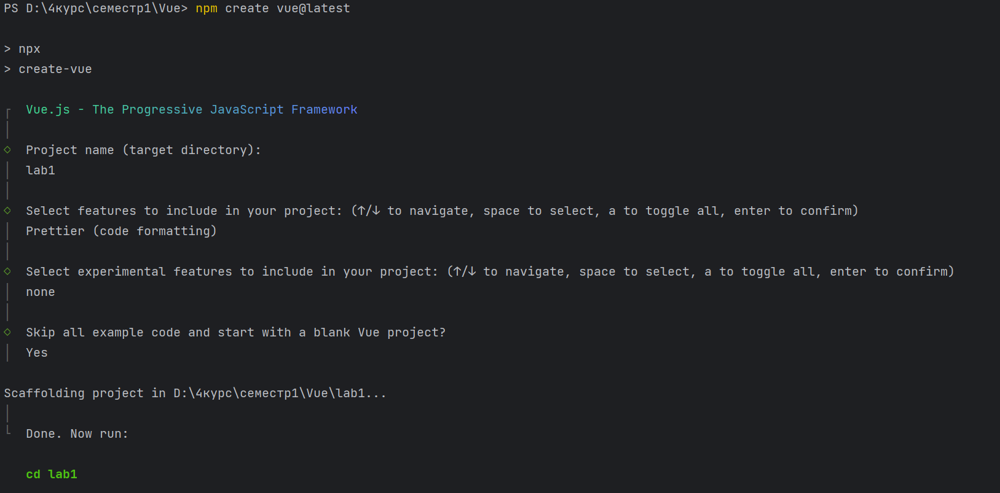
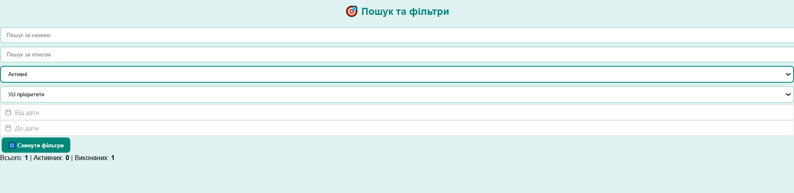
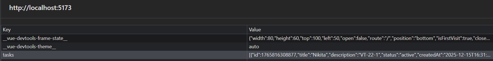

# lab1
### Створення проекту



### Налаштування prettier 


# Lab1 — ToDo Manager на Vue.js

## Опис
Простий застосунок для керування списком завдань із такими можливостями:
- Додавання завдання (мінімальна валідація);
- Перемикання статусу (active ↔ done);
- Видалення завдання;
- Редагування завдання;
- Фільтрація за полями (title, description, status, createdAt, priority);
- Очистка фільтрів;
- Лічильники (загальна кількість, активні, виконані);
- Вибір дати через `@vuepic/vue-datepicker`;
- Збереження у LocalStorage;
- Пагінація для зручності;
- Простий рожевий UI/UX.

---

## Кроки запуску

1. Клонувати репозиторій або відкрити проєкт у VS Code.
2. Встановити залежності:
   ```bash
   npm install

3. Запустити проєкт:
   ```bash
   npm run dev
4. Відкрити у браузері http://localhost:5173

## Використані можливості Vue

### Реактивність
- `ref` — використано для:
   - введення полів форми (title, description, priority);
   - фільтрів (наприклад, `filters.title`, `filters.createdAt`);
- `reactive` — для зберігання списку завдань як єдиної структури.

### Computed
- Підрахунок кількості:
   - `totalTasks` (усі завдання),
   - `activeTasks` (статус = active),
   - `completedTasks` (статус = done)
- Фільтрація завдань (відображаються тільки ті, що підходять під умови)

### Watch
- `watch(tasks, { deep: true })` — при будь-якій зміні списку він зберігається у LocalStorage

### Директиви
- `v-model` — прив’язка інпутів і селектів (title, description, priority, filters).
- `v-on / @` — обробка подій (`@click`, `@submit`).
- `v-bind / :` — прив’язка атрибутів (`:class`, `:placeholder`).
- `v-for` — відображення списку завдань та пагінації.
- `v-if / v-else` — умовне відображення повідомлень («Немає завдань»).
- `v-show` — використано для показу/приховування елементів у фільтрах.

---

## DevTools
- **LocalStorage**: у вкладці Application → LocalStorage зберігається весь список завдань у форматі JSON.
- **Computed**: у Vue DevTools можна переглянути, як автоматично обчислюються `totalTasks`, `activeTasks`, `completedTasks`.
- **Watch**: видно, як при зміні списку він автоматично оновлюється в LocalStorage.

---

## Скріншоти

### Головний інтерфейс
Створення нового завдання

### Фільтри
Фільтр по виконанних завданнях

Фільтр по активних завданнях



### LocalStorage

---


# lab7
## Запуск тестів
### ▶ Unit / Component тести (Vitest)

```bash
npm run test:unit
```
UI режим:
```bash
npm run test:unit:ui
```
---
## Coverage (покриття коду)

### ▶ Запуск аналізу покриття

```bash
npm run test:unit:cov
```
### Де переглядати результат Coverage

- **У консолі** — після запуску тестів з покриттям буде виведено статистику:
    - statements
    - branches
    - functions
    - lines

- **HTML-репорт** (генерується автоматично):
`coverage/index.html`
---
### End-to-End тести (Playwright)

#### Запуск у headless режимі
```bash
npm run test:e2e
```
Запуск у headed режимі (видно браузер)
```bash
npm run test:e2e:headed
```
UI-режим Playwright (візуальний інтерфейс)
```bash
npm run test:e2e:ui
```
---
## Покриття (Coverage)

### Загальний відсоток покриття
**75%**

Звіт генерується після виконання команди:

```bash
npm run test:unit:cov
```
## Які компоненти покрито тестами
| Компонент / Функція            | Статус   | Пояснення |
|--------------------------------|----------|-----------|
| **TaskManager.vue**            | Покрито | Протестовано рендер компонента та додавання задачі |
| **TodoItem.vue**               | Покрито | Перевірено роботу props та подій (update, кнопки) |
| **TodoList.vue**               | Покрито | Перевірено рендер динамічного списку задач |
| **getActiveCount.js**          | Покрито | Юніт-тест чистої функції (патерн AAA) |
| **Фільтри, дата, пріоритет**   | Частково | Логіка покрита у E2E-тестах, але unit-тестів немає |
---
## Unit / Component Tests — Реалізовані тести

### 1. `TaskManager.test.js`
- компонент монтується без помилок
- додається нове завдання
- перевірка відображення тексту
- перевірка реактивності `v-model`

### 2. `TodoItem.test.js`
- коректно рендеряться `props` (`title`, `status`)
- клік по кнопці викликає `emit`
- тест `update:modelValue` для `v-model`

### 3. `TodoList.test.js`
- рендер правильного числа задач
- кожен `TodoItem` відображається окремо
- передача `props` у дочірні компоненти

### 4. `getActiveCount.test.js`
- дотримання AAA-патерну
- перевірка обчислення кількості активних задач

---

## End-to-End Tests — Реалізовані сценарії

### 1. Відкриття головної сторінки
- перехід на `/`
- перевірка наявності заголовка **"Список завдань"**

### 2. Додавання і видалення задачі
- заповнення форми
- додавання задачі
- перевірка появи елемента в DOM
- видалення задачі
- перевірка, що елемент зник

### 3. Фільтрація задач
- створення декількох задач
- фільтрація по тексту
- фільтрація по статусу
- фільтрація по пріоритету
- перевірка зміни списку після фільтрації

---

## Додатково (усі вимоги виконано)

### ► Playwright Codegen
- один E2E-тест згенерований автоматично через `npx playwright codegen`

### ► UI Mode
- запущено через `npm run test:e2e:ui`

